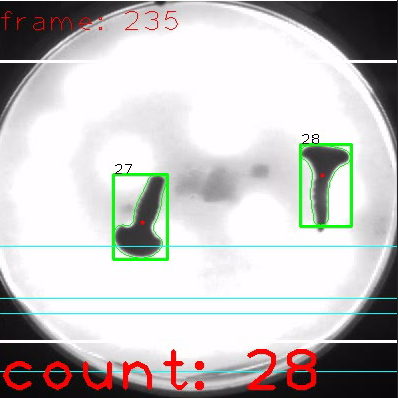

# Count-Drop
 Count free falling object - openCV

## How to run
- Setup device
- Install camera driver
- Setup environment (python) and install dependence packages (opencv, pylon)
- Correct parameters in code
- Run

## Screenshot

